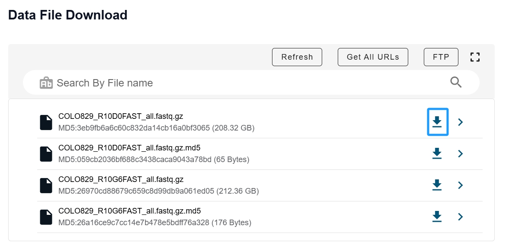

# How to download data from ScienceDB
## Introduction
Our basecalled data is shared via ScienceDB, an open, trusted global database for data publishing. We selected ScienceDB over popular options like FigShare or Zenodo due to the large size of our data.

## Ways to download
1. Web browser
    This method allows for `anonymous` downloading. Simply open the shared link in a web browser and click on the download link to access the data.
    

   
2. FTP
   This method requires Login to the ScienceDB
